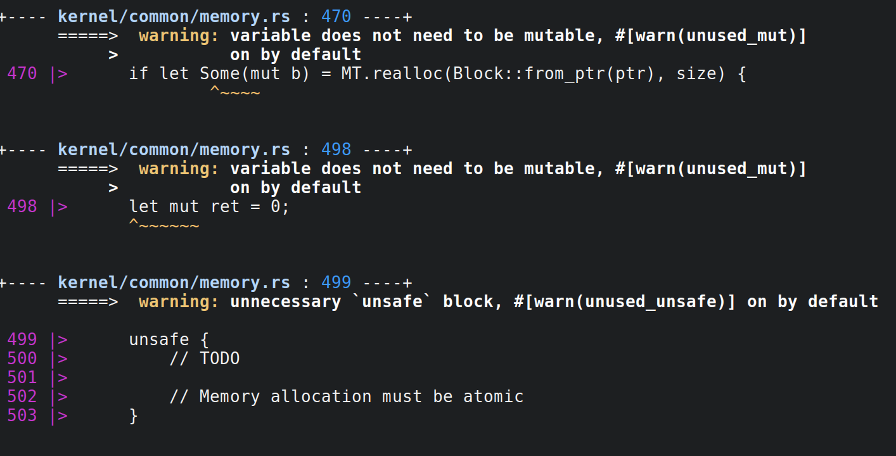

# dybuk
Dybuk cleans up the ugly Rustc messages (inspired by Elm). Dybuk supports some other compilers aswell.



## Usage

First of all install dybuk. When that's done, you can pipe Rustc output through dybuk:

```
cargo build |& dybuk
```
